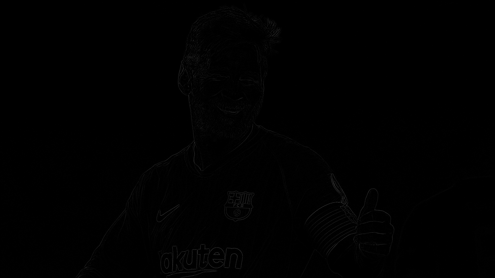
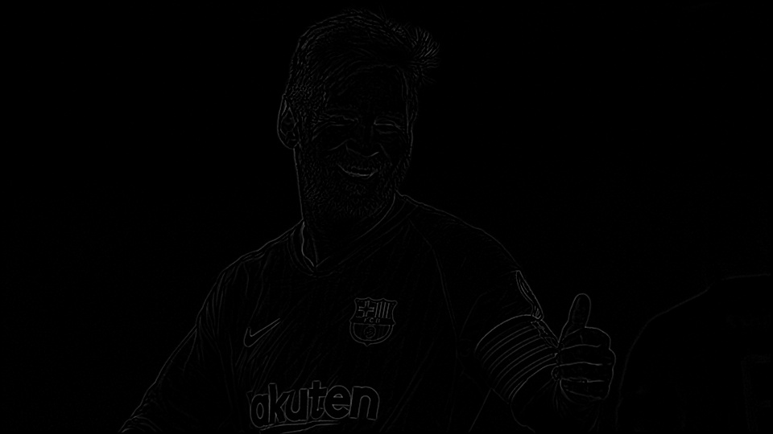
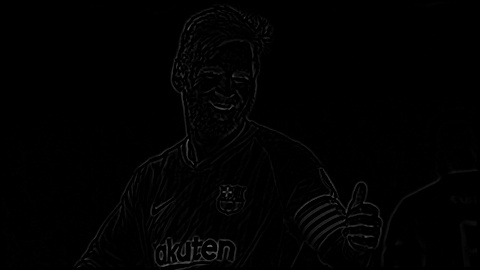
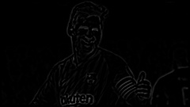
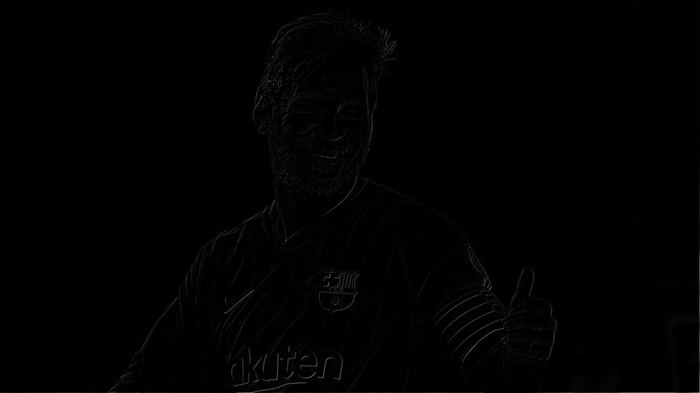
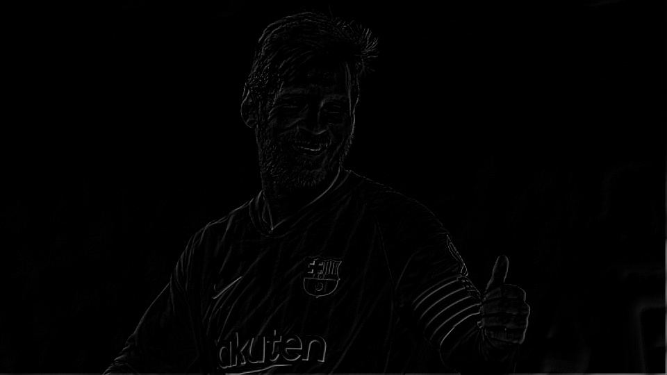
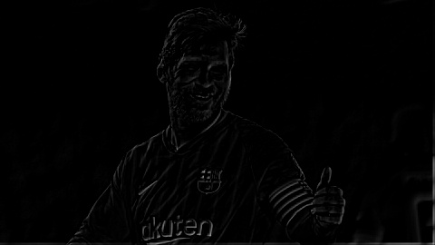

# image_pyramid
<h1> Gaussian And Laplacian Image Pyramids </h1>
This is an implementation of Gaussian and Laplacian Image Pyramids from coded up from Scratch. 

 To run this, place the image you wish to run the Algorithm inside "seed_images", and in the Notebook set the variable "imageName" to that file. 

 An image pyramid is a multiscale representation of an image. This is achieved by repeatedly smoothing and subsampling the image in order to achieve the desired resolution 

<h3> Sample Input: </h3>

  

<h3> Results: Gaussian Pyramid </h4>

<h5> Level 1 </h5>

  

<h5> Level 2 </h5>

  

<h5> Level 3 </h5>

  

<h5> Level 4 </h5>

  

<h3> Results: Laplacian of Gaussian Pyramid </h4>

<h5> Level 1 </h5>

  

<h5> Level 2 </h5>

  

<h5> Level 3 </h5>

  

<h5> Level 4 </h5>

  

<h3> Results: Difference of Gaussian Pyramid </h4>

<h5> Level 1 </h5>

  

<h5> Level 2 </h5>

  

<h5> Level 3 </h5>

  

<h5> Level 4 </h5>

  

  
<b>
 PS: Increase Brightness for better visibility of results 
 </b>

 You can read more about Image Pyramids <a href="https://en.wikipedia.org/wiki/Pyramid_(image_processing)"> here</a>.

 You can read more about Gaussian Filters <a href="https://en.wikipedia.org/wiki/Gaussian_filter"> here</a>.

 You can read more about Laplacian and other Edge filters <a href="http://www.aishack.in/tutorials/sobel-laplacian-edge-detectors/"> here</a>.

